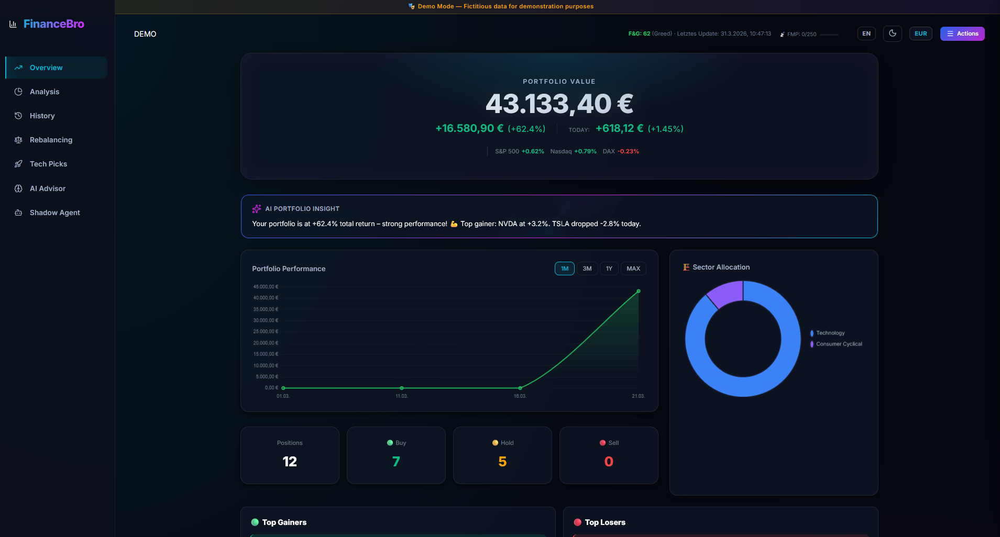
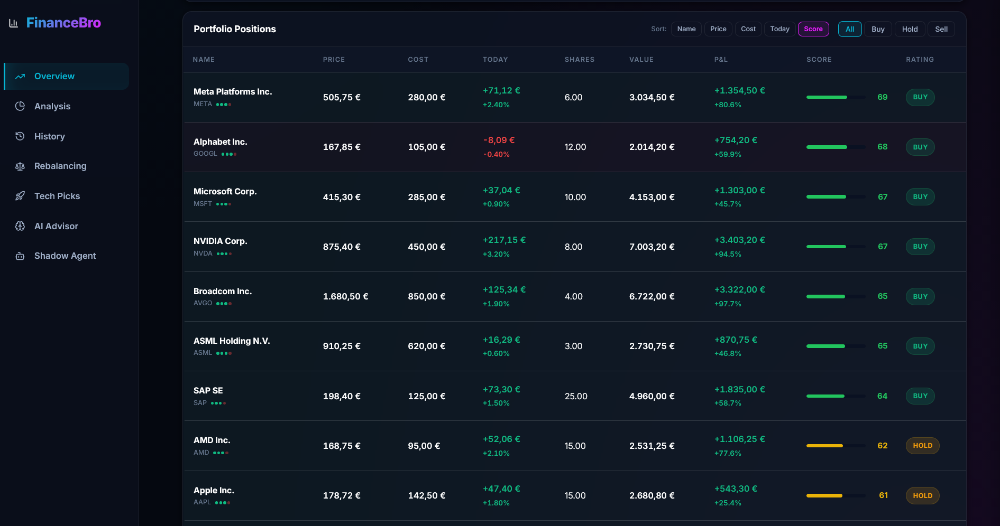
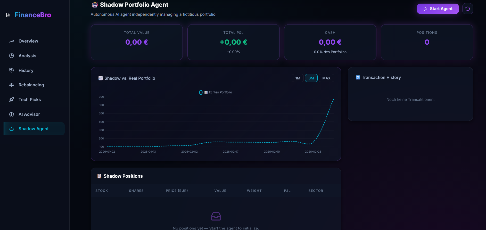
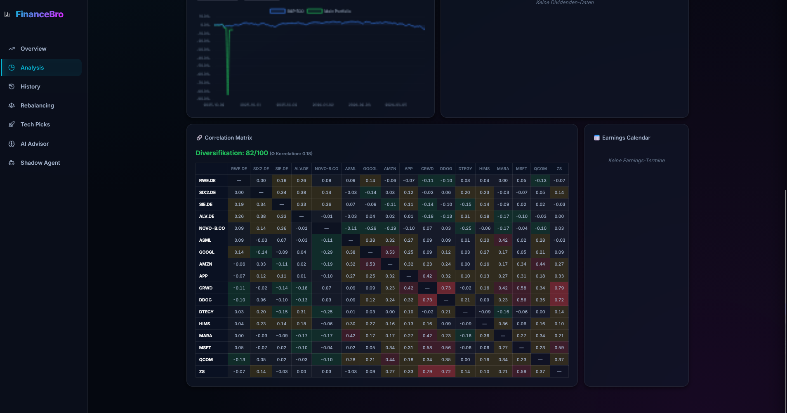
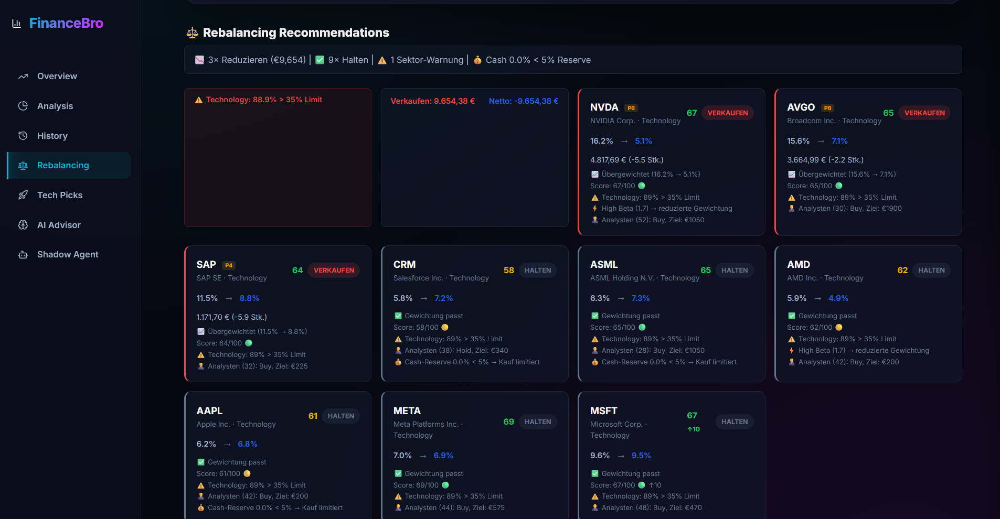
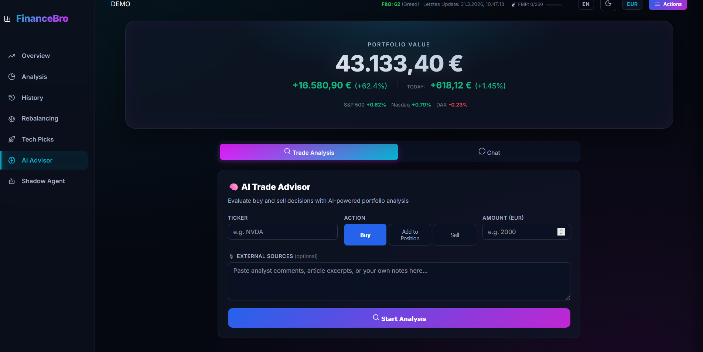

# 🤖 FinanceBro – AI-Driven Portfolio Agent

[](LICENSE)
[](https://python.org)
[](https://fastapi.tiangolo.com)
[](https://ai.google.dev)
[](https://cloud.google.com/run)
[](tests/)
[](https://github.com/jonasarmbrust/FinanceBro/actions)

> **Watch the markets. Reason with data. Act on conviction.**

FinanceBro is not just a dashboard—it is a full-fledged **AI Financial Agent** built around Google's Gemini 2.5 Pro. It autonomously monitors your stock portfolio, analyzes real-time market conditions, and communicates with you via a beautiful web UI and a proactive Telegram bot. By combining a hard-coded 10-factor quantitative model with sophisticated LLM reasoning, it bridges the gap between classic stock screeners and modern agentic AI.

## 🧠 The Agent Architecture (Why it's an Agent)

FinanceBro operates on the modern Agent paradigm (*Perceive → Reason → Act*):

1. **📡 Perception (Sensory Input):** The agent autonomously "watches" the market through real-time data streams (yFinance WebSockets, Parqet API, CNN Fear & Greed) and continuously ingests live news feeds without requiring user interaction.
2. **🧠 Reasoning (The Brain):** Powered by **Gemini 2.5 Pro**, the system fuses structured quantitative data (its proprietary 10-factor scoring model) with unstructured narrative data (global news) to synthesize context-aware risk assessments and buy/sell convictions.
3. **🛠️ Action (Function Calling):** Unlike a static chatbot, the AI utilizes explicit **Function Calling** to interact directly with the FastAPI backend—pulling live charts, calculating specific sector impacts, and executing analytical workflows dynamically when you ask it complex questions.
4. **⏱️ Autonomy (Proactivity):** Driven by an APScheduler, the agent operates autonomously in the background. It curates a "News Digest" 4x a day, compiles an End-of-Day analysis, and proactively pushes critical push notifications to your Telegram, completely eliminating the need to refresh a dashboard.



## ✨ Core Features

🎯 **10-Factor Scoring Model** — Deep fundamental analysis fusing Quality, Valuation, Momentum, Analyst Ratings, ESG, and Insider trades into a strict 0–100 score.

⚖️ **Conviction-Based Rebalancing** — Algorithmically generates portfolio rebalancing targets based on scoring conviction and strict sector-weighting risk controls.

📱 **Continuous Telegram Integration** — Connect with your AI agent anywhere. Supports `/score` commands, voice-to-text queries, and free-form portfolio chatting.

👻 **Shadow Portfolio Agent** — A full autonomous paper-trading engine that builds, tests, and validates AI-driven investment strategies (Aggressive, Balanced, Conservative) in real-time alongside your main portfolio.

📄 **Universal CSV Import** — Provide your portfolio strictly locally via CSV export from any standard broker; no third-party tracking accounts required.

🌐 **Premium SaaS Dashboard** — Bilingual (EN/DE), Dark/Light Apple-Glass aesthetics, and Server-Sent Events (SSE) for zero-reload live price ticks.

## 🛠️ Tech Stack

| Layer | Technologies |
|---|---|
| **Backend** | Python 3.12, FastAPI, Uvicorn, Pydantic, APScheduler |
| **AI** | Google Gemini 2.5 Pro + Flash (Function Calling, Structured Output, Context Caching) |
| **Data** | Parqet API (OAuth2/PKCE), CSV Import, FMP API, yFinance, CNN Fear & Greed |
| **Frontend** | Vanilla HTML/JS/CSS, Chart.js, SSE Streaming, Dark/Light Mode, i18n (DE/EN) |
| **Infrastructure** | Docker, Google Cloud Run (Service + Job), SQLite |
| **Bot** | Telegram Bot API (Commands, Voice Input, Inline Buttons) |
| **Tests** | pytest (390+ tests, 22 test files) |

## 💡 The Vision: From Dashboard to Autonomous Agent

I built FinanceBro to answer a simple question: **What happens when you give an LLM direct access to real-time financial APIs and background automation?**

The answer is a shift from *passive* tools to *active* companions. Traditional dashboards force you to log in, pull data, and run your own analysis. FinanceBro reverses this dynamic. It watches the markets while you sleep, cross-references breaking news against a proprietary 10-factor quantitative model, and actively pings *you* on Telegram when it has high-conviction insights. 

What started as a simple stock scoring script evolved quickly into a production-grade Agent system. It taught me that the true power of AI models like Gemini isn't just in chatting—it's in **Function Calling** and **Autonomy**. FinanceBro is no longer a side project; it sits in my pocket as an autonomous, 24/7 wealth advisor that I talk to every single day.

## Screenshots

<table>
  <tr>
    <td><br/><em>Portfolio positions with scoring</em></td>
    <td><br/><em>Stock detail with score breakdown</em></td>
  </tr>
  <tr>
    <td><br/><em>Analysis: sectors, risk, benchmark, dividends</em></td>
    <td><br/><em>Conviction-based rebalancing</em></td>
  </tr>
  <tr>
    <td><br/><em>AI-powered tech recommendations</em></td>
    <td><br/><em>AI Trade Advisor (Gemini 2.5 Pro)</em></td>
  </tr>
</table>

### 🤖 Telegram Bot

<table>
  <tr>
    <td><br/><em>Daily AI Report</em></td>
    <td><br/><em>Weekly Digest</em></td>
    <td><br/><em>Proactive News Alerts</em></td>
  </tr>
</table>

## Architecture

```
Browser (HTML/JS/CSS + i18n DE/EN)
    ↕ REST API + SSE
FastAPI Backend (local / Cloud Run)
    ├── routes/          → API endpoints (portfolio, AI advisor, CSV upload)
    ├── engine/          → Scoring, analysis, rebalancing, attribution
    ├── services/        → Portfolio builder, AI agent, Telegram bot, Vertex AI
    ├── fetchers/        → Data sources (Parqet, CSV, FMP, yfinance)
    ├── static/          → Dashboard SPA + translations.js (200+ i18n keys)
    ├── database.py      → SQLite persistence (WAL, score history, snapshots)
    └── cache/           → In-memory + disk caches
```

## Data Sources

| Source | Module | Auth | Provides |
|---|---|---|---|
| **Parqet** | `fetchers/parqet.py` | OAuth2 / JWT | Portfolio positions, cost basis, sectors |
| **CSV Import** | `fetchers/csv_reader.py` | – | Portfolio positions from any CSV file (no account needed) |
| **FMP** | `fetchers/fmp.py` | `FMP_API_KEY` | Fundamentals, analysts, dividends, news (6h cache protection) |
| **yfinance** | `fetchers/yfinance_data.py` | – | Prices, recommendations, insider, ESG, earnings surprise, Altman Z, Piotroski |
| **yFinance WS** | `fetchers/yfinance_ws.py` | – | Real-time prices (WebSocket, international) |
| **yFinance Screener** | `fetchers/yfinance_screener.py` | – | Stock discovery (EquityQuery) |
| **CNN** | `fetchers/fear_greed.py` | – | Fear & Greed Index |
| **Vertex AI** | `services/vertex_ai.py` | GCP Service Account | Gemini Pro/Flash, Search Grounding |

> FMP Free Tier: 250 requests/day with 6h cache protection. All other sources are free.

## Scoring Engine (`engine/scorer.py`)

10-factor scoring system (0–100 composite score):

| Factor | Weight | Source |
|---|---|---|
| Quality (ROE, Margins, Debt) | 19% | FMP |
| Analyst Consensus + Price Targets | 15% | FMP (verified via track record) |
| Valuation (P/E, EV/EBITDA, PEG) | 14% | FMP |
| Technical (RSI, SMA, Momentum) | 13% | yfinance |
| Growth (Revenue, Earnings YoY, Beat Rate) | 11% | FMP + yfinance (Earnings Surprise) |
| Quantitative (Altman Z, Piotroski) | 10% | yfinance (self-calculated) |
| Market Sentiment (Fear&Greed) | 7% | CNN |
| Momentum (90d, 180d) | 6% | yfinance |
| Insider Trading | 3% | yfinance |
| ESG Risk | 2% | yfinance (`sustainability` + `info` fallback) |

**Rating:** Buy (≥68), Hold (40–67), Sell (<40)

## AI Features (Vertex AI / Gemini)

| Feature | Model | Description |
|---------|-------|-------------|
| **AI Trade Advisor** | Pro + Grounding + **Function Calling** | 🧠 Agentic advisor — Gemini autonomously calls tools |
| **AI Chat** | Pro + **Function Calling** | 💬 Free-form portfolio discussion in browser |
| **Voice-to-Action** | Pro + **Function Calling** + Audio | 🎙️ Voice messages natively to Gemini (Telegram) |
| **News Curator** | Flash + Grounding + **Structured Output** | 📡 Proactive portfolio news alerts (4×/day) |
| Score Commentaries | Flash + **Structured Output** | AI commentary per stock on each refresh |
| Earnings Analysis | Pro + Grounding + **Structured Output** | `/earnings` — Real-time earnings via Search |
| Portfolio Chat | Pro + Grounding | Free-text questions in Telegram |
| Weekly Digest | Flash | Weekly summary (Sunday 18:00) |
| Risk Scenarios | Pro + Grounding | `/risk` — AI-powered stress analysis |
| Performance Attribution | Engine | P&L by sector, top/flop, Herfindahl Index |

### Function Calling (Trade Advisor)
Gemini 2.5 Pro has access to 3 tools and autonomously decides which data is needed:
- `get_stock_score(ticker)` — Calculate 10-factor score
- `get_portfolio_overview()` — Fetch portfolio context
- `get_sector_impact(ticker, action, amount)` — Simulate sector impact

### Async AI Integration
All Gemini API calls use the async SDK (`client.aio.models.generate_content`). This prevents blocking the FastAPI `asyncio` event loop during long AI inference times, ensuring the dashboard remains responsive at all times.

### Structured Output
All JSON-based AI services use `response_schema` — Gemini guarantees valid JSON output.

## Rebalancing Engine v3 (`engine/rebalancer.py`)

| Feature | Description |
|---------|-------------|
| Cash Reserve (R1) | Min. 5% cash is never invested |
| Total Portfolio Basis (R2) | `total_value` including cash → realistic weights |
| Investable Cash (R3) | Buy recommendations limited to available cash |
| Conviction Sizing (R4) | High (≥70): 1.5×, Mid (45-69): 1.0×, Low (<45): 0.6× |
| Portfolio Health Score (R5) | 0-100 score: HHI, sector, beta, quality, position count |

## CSV Portfolio Import

No Parqet account? Import your portfolio from any CSV file:

```csv
ticker,shares,buy_price,buy_date,currency,sector,name
AAPL,15,142.50,2024-03-15,USD,Technology,Apple Inc.
MSFT,10,285.00,2024-01-20,USD,Technology,Microsoft Corp.
```

**Required columns:** `ticker`, `shares`, `buy_price`
**Optional columns:** `buy_date`, `currency` (default: USD), `sector`, `name`

The import flow:
1. Upload CSV via dashboard (Actions → CSV Import)
2. Preview parsed positions before importing
3. Live prices are fetched automatically from yFinance
4. All scoring, AI, and analytics features work identically

> An `example_portfolio.csv` is included in the repository.

### 👨‍💻 Developer Note: Custom Broker Exports
If you want to use the raw CSV exports from your specific broker (e.g., Trade Republic, Scalable Capital, Interactive Brokers) without manually reformatting the columns first, you can easily adapt the parser! 

Just open `fetchers/csv_reader.py` and modify the `parse_csv` logic. The system is designed to be highly modular—you simply need to map your broker's specific column names to the expected internal format (`ticker`, `shares`, `buy_price`).

## Bilingual UI (DE/EN)

The dashboard supports German and English. Click the language toggle (DE/EN) in the header to switch. The AI Trade Advisor and Chat also respond in the selected language. Preference is saved in `localStorage`.

## Telegram Bot (`/help` for all commands)

| Command | Description |
|---------|-------------|
| `/portfolio` | Portfolio overview |
| `/score [TICKER]` | Score + AI commentary |
| `/refresh` | Trigger data refresh |
| `/attribution` | P&L attribution (sector, top/flop) |
| `/earnings [TICKER]` | Earnings analysis (AI) |
| `/risk` | Risk scenarios (AI) |
| `/news-alerts` | Check portfolio news (AI) |
| 🎙️ Voice message | Voice-to-action (AI) |
| Free text | Portfolio chat (AI) |

## API Endpoints

42+ REST endpoints, grouped into 6 modules:

| Module | Endpoints | Highlights |
|---|---|---|
| **Portfolio** | 11 | Dashboard, positions, sectors, Fear & Greed |
| **Analytics** | 13 | Benchmark, correlation, risk, dividends, heatmap |
| **AI Advisor** | 8 | Trade evaluation, chat, backtest, score trends |
| **Refresh** | 8 | Granular updates (prices, scores, reports) |
| **Demo** | 3 | Demo portfolio activate/deactivate |
| **Streaming** | 1 | SSE real-time prices |

📖 **[Full API Documentation →](docs/api.md)**

## Persistence

| Storage | Technology | Contents |
|---------|-----------|----------|
| SQLite (`financebro.db`) | WAL mode, thread-safe | Score history, snapshots, reports |
| JSON Cache | Memory + Disk | FMP, yFinance, Fear&Greed (volatile) |
| Parqet Cache | Memory + Disk | Positions, tokens (persistent) |

## Security

| Protection | Configuration |
|-----------|---------------|
| **Dashboard Password** | `DASHBOARD_USER` + `DASHBOARD_PASSWORD` in `.env` |
| **Telegram Webhook** | `TELEGRAM_WEBHOOK_SECRET` — secret in URL path |
| **Chat ID Filter** | Bot only responds to configured `TELEGRAM_CHAT_ID` |

## Deployment

### Local
```bash
python -m venv venv
pip install -r requirements.txt
python main.py  # → http://localhost:8000
```

### Cloud Run Service (Dashboard + Webhook)
```bash
./deploy.sh
```

### Cloud Run Job (daily Telegram report, free tier)
```bash
./deploy_job.sh  # Creates Job + Cloud Scheduler (15:45 CET)
```

### Environment (.env)
```env
# Required
FMP_API_KEY=...
PARQET_PORTFOLIO_ID=...

# Optional (Advanced Features)
TELEGRAM_BOT_TOKEN=...
TELEGRAM_CHAT_ID=...
GEMINI_API_KEY=...

# Security
DASHBOARD_USER=...
DASHBOARD_PASSWORD=...
TELEGRAM_WEBHOOK_SECRET=...

# Cloud Run (automatic)
ENVIRONMENT=production
GCP_PROJECT_ID=...
```

### Scheduler

| Job | Schedule | Function |
|-----|----------|----------|
| Full Analysis | 16:15 | Refresh + Scoring + AI Report |
| Intraday Prices | Every 15 min (Mon-Fri) | yFinance Batch |
| Weekly Digest | Friday 22:30 | Weekly AI summary |
| News Curator | 09, 13, 17, 21h (Mon-Fri) | Portfolio news alerts (Gemini Flash) |
| Cloud Run Job | 15:45 (Cloud Scheduler) | Full Refresh → Telegram Report |

## Project Structure

```
FinanceBro/
├── main.py              # FastAPI app + startup + scheduler
├── config.py            # Pydantic Settings v2
├── models.py            # 31 Pydantic models
├── state.py             # Global app state
├── database.py          # SQLite persistence (WAL, 3 tables)
├── cache_manager.py     # Memory + disk cache
├── logging_config.py    # structlog (JSON/Console)
├── Dockerfile           # Cloud Run Service container
├── Dockerfile.job       # Cloud Run Job container
├── run_job.py           # Job entry point (Refresh → Report)
├── middleware/
│   └── auth.py          # Basic Auth middleware
├── engine/
│   ├── scorer.py        # 10-factor score calculation
│   ├── analysis.py      # Report generation + score history
│   ├── analytics.py     # Correlation, risk, dividends
│   ├── rebalancer.py    # Rebalancing recommendations
│   ├── attribution.py   # P&L attribution + Herfindahl Index
│   ├── portfolio_history.py # Portfolio history (per-stock, cash, cost basis)
│   ├── history.py       # Portfolio snapshots → SQLite
│   ├── backtest.py      # Score backtest engine
│   └── sector_rotation.py # Sector rotation analysis (ETF-based)
├── fetchers/
│   ├── parqet.py        # Parqet Connect API (OAuth2 PKCE)
│   ├── parqet_auth.py   # Token management
│   ├── fmp.py           # Financial Modeling Prep
│   ├── yfinance_data.py # Yahoo Finance (batch, fundamentals, earnings surprise)
│   ├── yfinance_ws.py   # yFinance WebSocket (real-time, international)
│   ├── yfinance_screener.py # Stock discovery (EquityQuery)
│   ├── technical.py     # RSI, SMA, MACD
│   ├── fear_greed.py    # CNN Fear & Greed
│   ├── currency.py      # Exchange rates
│   └── demo_data.py     # Demo data
├── services/
│   ├── refresh.py       # Main refresh (with progress tracking)
│   ├── data_loader.py   # Parallel batch loading
│   ├── portfolio_builder.py # Parqet update + yFinance prices + portfolio totals
│   ├── ai_agent.py      # Daily AI Telegram report
│   ├── telegram.py      # Telegram API
│   ├── telegram_bot.py  # Telegram bot (command handler)
│   ├── vertex_ai.py     # Gemini client + context caching
│   ├── trade_advisor.py # AI Trade Advisor (Function Calling + Structured Output + Chat)
│   ├── earnings_ai.py   # Earnings analysis (Structured Output)
│   ├── score_commentary.py  # AI score commentaries (Structured Output)
│   ├── weekly_digest.py # Weekly digest (Flash)
│   ├── news_kurator.py  # Proactive portfolio news alerts (Structured Output)
│   ├── tech_radar_ai.py # Tech recommendations (AI)
│   ├── analyst_tracker.py   # Analyst track record
│   ├── knowledge_data.py    # Knowledge base (project facts + daily tips)
│   ├── url_fetcher.py       # URL content fetcher (HTML→Text for AI tools)
│   └── currency_converter.py
├── routes/
│   ├── portfolio.py     # Portfolio + dashboard
│   ├── refresh.py       # Refresh + status
│   ├── analysis.py      # Analysis reports
│   ├── analytics.py     # Extended analytics + attribution
│   ├── demo.py          # Demo mode toggle (activate/deactivate/status)
│   ├── parqet_oauth.py  # OAuth2 PKCE
│   ├── streaming.py     # SSE price stream
│   └── telegram.py      # Telegram webhook (with secret token)
├── static/
│   ├── index.html       # Dashboard UI
│   ├── app.js           # Frontend logic
│   └── styles.css       # Styling
└── tests/               # 368+ pytest tests (21 test files)
```
