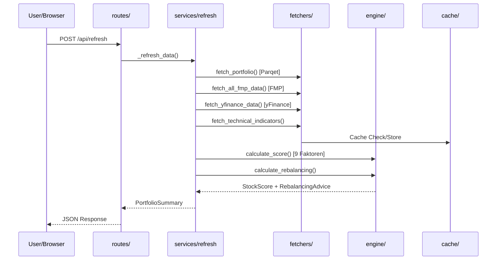
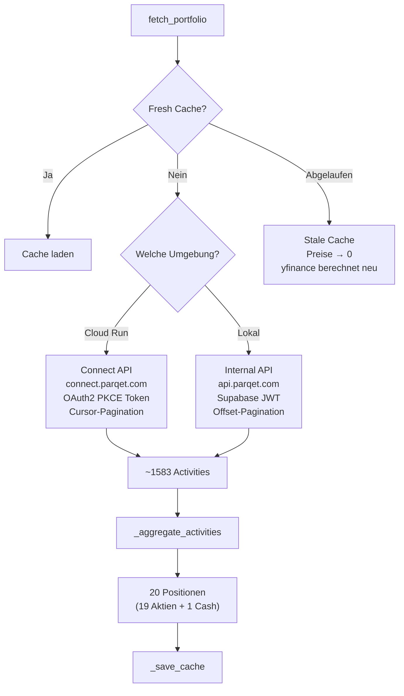

# FinanzBro – Architektur

## Übersicht

FinanzBro ist ein intelligentes Aktienportfolio-Dashboard mit automatisierter Multi-Faktor-Analyse.  
Läuft lokal (Python) und auf Google Cloud Run (Docker).

```
FinanzBro/
├── main.py                 # FastAPI App + Lifespan + Scheduler
├── config.py               # Zentrale Konfiguration (.env)
├── models.py               # Pydantic Datenmodelle
├── state.py                # Globaler State + yFinance Aliases
├── cache_manager.py        # Thread-safe Memory+Disk Cache
│
├── routes/
│   ├── portfolio.py        # GET /api/portfolio, /api/stock/{ticker}
│   ├── refresh.py          # POST /api/refresh, /api/refresh/prices
│   ├── analysis.py         # POST /api/analysis/run, GET /api/analysis/latest
│   ├── analytics.py        # Dividenden, Risiko, Korrelation, Benchmark
│   ├── parqet_oauth.py     # GET /api/parqet/authorize + /callback (OAuth2 PKCE)
│   └── streaming.py        # GET /api/prices/stream (SSE)
│
├── services/
│   ├── refresh.py          # Refresh-Logik (Portfolio, Preise, Scores)
│   ├── currency_converter.py # Zentrale EUR-Konvertierung
│   ├── ai_agent.py         # Gemini AI + Telegram Reports
│   ├── telegram.py         # Telegram Bot API
│   └── scheduler.py        # APScheduler Jobs
│
├── engine/
│   ├── scorer.py           # 9-Faktor Scoring Engine
│   ├── rebalancer.py       # Portfolio-Rebalancing
│   ├── analysis.py         # Analyse-Reports + Score-Historie
│   ├── analytics.py        # Korrelation, Risiko, Dividenden
│   └── history.py          # Portfolio-Snapshots (365 Tage)
│
├── fetchers/
│   ├── parqet.py           # Parqet API (Dual: Internal + Connect)
│   ├── parqet_auth.py      # Token-Management (JWT, Firefox, OAuth2 PKCE)
│   ├── fmp.py              # Financial Modeling Prep API
│   ├── yfinance_data.py    # yFinance (Batch-Download in 5er-Chunks)
│   ├── finnhub_ws.py       # Finnhub WebSocket (Echtzeit US)
│   ├── technical.py        # RSI, SMA, MACD Berechnung
│   ├── fear_greed.py       # CNN Fear & Greed Index
│   ├── currency.py         # EUR/USD/DKK/GBP Wechselkurse
│   └── demo_data.py        # Synthetische Demo-Daten
│
├── static/                 # Frontend (HTML/JS/CSS)
├── scripts/                # Deploy- und Token-Helper
└── tests/                  # 223 pytest Tests
```

## Datenfluss



## Parqet API-Anbindung

Zwei parallele API-Wege zum gleichen Ergebnis:



### Pagination
- **Connect API:** Cursor-basiert (`{"activities": [...], "cursor": "abc"}`)
- **Internal API:** Offset-basiert (`?limit=100&offset=N`, `hasMore` Flag)

### Token-Renewal (parqet_auth.py)
1. Gespeicherter Token prüfen (JWT `exp` dekodieren)
2. Connect API Refresh (`refresh_token` → `connect.parqet.com/oauth2/token`)
3. Firefox-Cookie Fallback (nur lokal: `parqet-access-token`)

## Caching-Strategie

| Cache-Typ | Verhalten | Beispiele |
|-----------|-----------|-----------|
| **Volatile** | Beim Start gelöscht | FMP, yFinance, Fear&Greed |
| **Persistent** | Bleibt zwischen Restarts | Parqet, Currency |
| **Stale Cache** | Ohne TTL als Fallback | Parqet-Positionen (Cloud Run) |

- **Memory-First**: Alle Lookups in O(1) aus RAM
- **Disk-Backup**: JSON-Persistierung in `cache/`
- **Docker-Image**: Cache wird via `COPY . .` eingebacken → Fallback auf Cloud Run

## Cloud Run Deployment

```
Docker Image (python:3.12-slim)
  ├── App-Code
  ├── cache/ (eingebacken → Stale Cache Fallback)
  └── Env-Vars (Tokens, API Keys)

Konfiguration:
  Memory: 512 Mi
  CPU: 1
  Min Instances: 0 (Scale to Zero)
  Max Instances: 1
  Region: europe-west1
```

### Scheduler (APScheduler auf Cloud Run)

| Job | Zeit | Funktion |
|-----|------|----------|
| Daily Refresh | `06:00` | Voller Daten-Refresh |
| Price Update | alle `30 min` | Quick-Price-Refresh |
| AI Agent + Telegram | `15:50` | KI-Analyse + Report |
