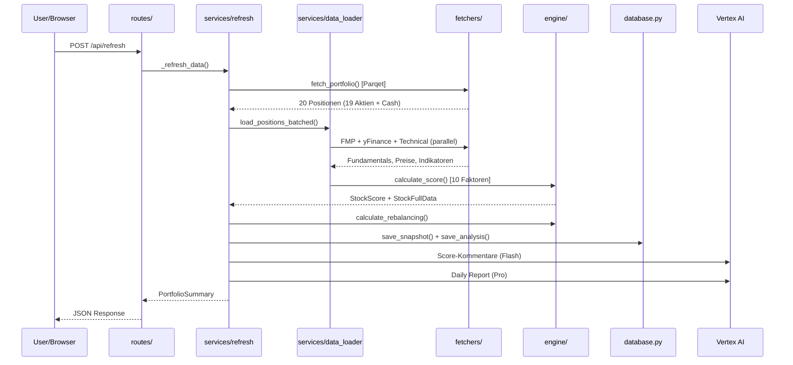
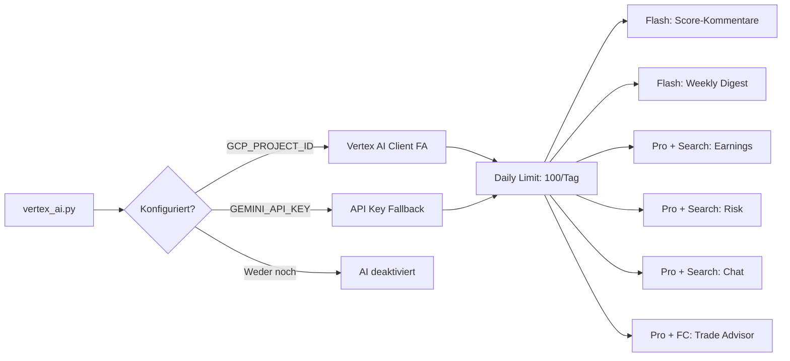

# FinanzBro – Architektur

## Übersicht

FinanzBro ist ein intelligentes Aktienportfolio-Dashboard mit automatisierter Multi-Faktor-Analyse.  
Läuft lokal (Python) und auf Google Cloud Run (Docker).

```
FinanzBro/
├── main.py                 # FastAPI App + Lifespan + Scheduler
├── config.py               # Pydantic Settings v2 (.env auto-loading)
├── models.py               # 31 Pydantic-Datenmodelle
├── state.py                # Globaler State + Refresh-Progress
├── database.py             # SQLite Persistenz (WAL, Score-History, Snapshots)
├── cache_manager.py        # Thread-safe Memory+Disk Cache
├── logging_config.py       # structlog (JSON in Production, Console in Dev)
├── run_job.py              # Cloud Run Job Entry Point (tägliche Analyse + Report)
│
├── routes/
│   ├── portfolio.py        # GET /api/portfolio, /api/stock/{ticker}
│   ├── refresh.py          # POST /api/refresh + GET /api/refresh/status
│   ├── analysis.py         # POST /api/analysis/run, GET /api/analysis/latest
│   ├── analytics.py        # Dividenden, Risiko, Korrelation, Attribution
│   ├── demo.py             # POST /api/demo/activate|deactivate, GET /status
│   ├── parqet_oauth.py     # GET /api/parqet/authorize + /callback (OAuth2 PKCE)
│   ├── streaming.py        # GET /api/prices/stream (SSE)
│   └── telegram.py         # Telegram Webhook
│
├── services/
│   ├── refresh.py          # Voller Refresh (mit Progress-Tracking)
│   ├── data_loader.py      # Paralleles Batch-Loading (4er Batches)
│   ├── currency_converter.py # Zentrale EUR-Konvertierung
│   ├── portfolio_builder.py  # Parqet-Update + yFinance-Preise + calc_portfolio_totals()
│   ├── ai_agent.py         # Gemini AI + Telegram Reports
│   ├── telegram.py         # Telegram Bot API
│   ├── telegram_bot.py     # Command-Router + Handler
│   ├── vertex_ai.py        # Gemini Client + Daily Limit + Context Cache
│   ├── earnings_ai.py      # Earnings-Analyse (Gemini Pro + Search)
│   ├── score_commentary.py # AI Score-Kommentare (Flash)
│   ├── weekly_digest.py    # Wöchentlicher Digest (Flash)
│   ├── tech_radar_ai.py    # AI-gestützte Tech-Empfehlungen
│   ├── trade_advisor.py    # AI Trade Advisor (Function Calling + Structured Output + Chat)
│   └── analyst_tracker.py  # Analysten Track Record Bewertung
│
├── engine/
│   ├── scorer.py           # 10-Faktor Scoring Engine v5
│   ├── rebalancer.py       # Portfolio-Rebalancing
│   ├── analysis.py         # Analyse-Reports → SQLite
│   ├── analytics.py        # Korrelation, Risiko, Dividenden
│   ├── attribution.py      # P&L Attribution (Sektor, Herfindahl-Index)
│   ├── history.py          # Portfolio-Snapshots → SQLite
│   ├── backtest.py         # Score-Backtest Engine
│   └── sector_rotation.py  # Sektor-Rotation-Analyse (ETF-basiert)
│
├── fetchers/
│   ├── parqet.py           # Parqet Connect API (Performance + Activities)
│   ├── parqet_auth.py      # OAuth2 Token-Management (PKCE, Refresh)
│   ├── fmp.py              # Financial Modeling Prep API
│   ├── yfinance_data.py    # yFinance v1.2.0 (Recs, Insider, ESG, Altman Z, Piotroski, Earnings, Fundamentals)
│   ├── finnhub_ws.py       # Finnhub WebSocket (Echtzeit US)
│   ├── yfinance_ws.py      # yFinance WebSocket (Echtzeit International)
│   ├── technical.py        # RSI, SMA, MACD Berechnung
│   ├── fear_greed.py       # CNN Fear & Greed Index
│   ├── currency.py         # EUR/USD/DKK/GBP Wechselkurse
│   ├── yfinance_screener.py # Tech-Aktien Screening (yfinance)
│   └── demo_data.py        # Synthetische Demo-Daten
│
├── middleware/
│   └── auth.py             # Basic Auth Middleware (Passwortschutz)
│
├── static/                 # Frontend (HTML/JS/CSS)
└── tests/                  # 367+ pytest Tests
```

## Stabilität & Concurrency

Das Backend ist auf Ausfallsicherheit bei hängenden externen APIs ausgelegt:
- **Timeouts & Netzwerk:** Alle asynchronen `httpx` Aufrufe und Hintergrund-Lade-Prozesse (wie `yfinance` Thread-Pools) haben strikte, garantierte Timeouts (meist 5s bis 30s), um `ThreadPoolExecutor`-Erschöpfung und Deadlocks zu verhindern.
- **Background Tasks:** WebSocket-Streamer und Daten-Loads laufen isoliert via `asyncio.create_task()`. Startup-Prozesse lassen den Lifespan dank `asyncio.wait_for()` nicht hängen.
- **I/O Threads:** Synchrone Datenbank-Operationen (z.B. SQLite-Migrationen) werden via `asyncio.to_thread()` aus dem Main-Event-Loop herausgehalten.

## Datenfluss



## Persistenz-Schichten

| Schicht | Technologie | Inhalt | Verlust bei Restart? |
|---------|------------|--------|---------------------|
| **SQLite** (`finanzbro.db`) | WAL-Modus | Score-History, Snapshots, Reports | Ja (Cloud Run) |
| **JSON Cache** | Memory + Disk | FMP, yFinance, Parqet | Teilweise (volatile) |
| **State** (`portfolio_data`) | In-Memory Dict | Aktuelles Portfolio, Activities | Ja |

> **Cloud Run Hinweis:** SQLite-Daten gehen bei Container-Restart verloren. Für Langzeit-Persistenz: Litestream → GCS Backup.

## Demo Mode

Expliziter Demo-Toggle für externe Präsentationen — unabhängig von API-Keys.

| Endpoint | Funktion |
|----------|----------|
| `POST /api/demo/activate` | Baut Demo-Portfolio (12 Positionen) aus statischen Daten |
| `POST /api/demo/deactivate` | Löscht Demo-Daten, startet echten Refresh |
| `GET /api/demo/status` | Gibt Demo-Status zurück |

- **Kein API-Call** nötig — alle Daten aus `fetchers/demo_data.py`
- **Komplettes Portfolio**: Fundamentals, Analysten, Technical, Scores, Rebalancing, Tech Picks
- **Frontend**: 🎭 Demo-Button im Header, Banner, Badge
- **History**: Synthetische 6-Monats-Verlaufsdaten

### Startup Port-Cleanup

`_kill_port_occupants()` in `main.py` beendet automatisch alte Server-Instanzen auf dem konfigurierten Port vor dem Start. Verhindert Whitescreen durch Zombie-Prozesse.

## AI-Architektur (Vertex AI)



## Caching-Strategie

### Cache-Typen

| Cache-Typ | Verhalten | Beispiele |
|-----------|-----------|-----------|
| **Volatile** | Beim Start gelöscht | Technical |
| **Persistent** | Bleibt erhalten | Parqet, Currency, FMP, yFinance, Fear&Greed |
| **State-Level** | Im Memory nach Refresh | Activities, Portfolio Summary |
| **Analytics** | In-Memory, 15min TTL, nach Refresh invalidiert | Korrelation, Risk, Benchmark |

### TTL pro Fetcher

| Cache | TTL | Begründung |
|-------|-----|------------|
| FMP | 24h | Fundamentaldaten ändern sich selten |
| yFinance | 24h | Recs, Insider, ESG, Altman Z, Piotroski, Earnings-Kalender, Fundamentals |
| Parqet | 12h | Portfolio-Positionen (Stale-Fallback bei Ablauf) |
| Currency | 12h | Wechselkurse (<0.5% Änderung/Tag) |
| Fear & Greed | 6h | Sentiment-Index (persistent über Restarts) |
| Technical | 4h | RSI, SMA, Momentum (volatile) |
| Analytics | 15min | Korrelation, Risk, Benchmark (invalidiert nach Refresh) |

### Startup-Cleanup

- Volatile Caches (Technical) werden beim Start gelöscht
- Verwaiste Dateien aus JSON→SQLite Migration werden aufgeräumt
- Activities-Cache auf Disk begrenzt auf 500 Einträge (~12 Monate)

## Sicherheit

| Schutzmaßnahme | Konfiguration | Schützt |
|----------------|---------------|---------|
| **Basic Auth** | `DASHBOARD_USER` + `DASHBOARD_PASSWORD` in `.env` | Dashboard + alle API-Endpoints |
| **Webhook Secret** | `TELEGRAM_WEBHOOK_SECRET` in `.env` | Telegram-Webhook (Secret im URL-Pfad) |
| **Chat-ID Filter** | `TELEGRAM_CHAT_ID` in `.env` | Bot antwortet nur auf deine Chat-ID |
| **timing-safe compare** | `secrets.compare_digest()` | Verhindert Timing-Attacks auf Passwort |

- Auth-Middleware in `middleware/auth.py` (Starlette BaseHTTPMiddleware)
- Ausgenommen: `/health` (Cloud Run Health Check), `/api/telegram/webhook/{secret}`
- Ohne `DASHBOARD_USER`/`DASHBOARD_PASSWORD` → kein Passwortschutz (z.B. lokal)

## Cloud Run Deployment

### Service (Dashboard + Webhook)
```
Docker Image (python:3.12-slim, 1 Worker)
  ├── App-Code + SQLite DB
  ├── cache/ (Stale Cache Fallback)
  └── Env-Vars (API Keys, OAuth2 Tokens, Auth)

Konfiguration:
  Memory:        512 Mi
  CPU:           1
  Min Instances: 0 (Scale to Zero)
  Max Instances: 1
  Region:        europe-west1
```

### Job (tägliche Analyse + Telegram Report)
```
Docker Image (Dockerfile.job, python:3.12-slim)
  └── CMD: python run_job.py

Ablauf:
  1. Full Refresh (Parqet, FMP, yfinance, Technicals, Scoring)
  2. Daten-Validierung (Positionen + Scores vorhanden?)
  3. Gemini AI Research → Telegram Report

Trigger: Cloud Scheduler → 15:45 CET täglich
Kosten:  0 €/Monat (Free Tier)
```

### Scheduler (APScheduler)

| Job | Zeit | Funktion |
|-----|------|----------|
| Full Analyse | 16:15 CET | Refresh + Scoring + AI Report |
| Intraday Kurse | alle 15min Mo-Fr 8-22h | yFinance Batch |
| Weekly Digest | Freitag 22:30 | KI-Zusammenfassung |
| Cloud Run Job | 15:45 CET (Cloud Scheduler) | Full Refresh → Telegram Report |
